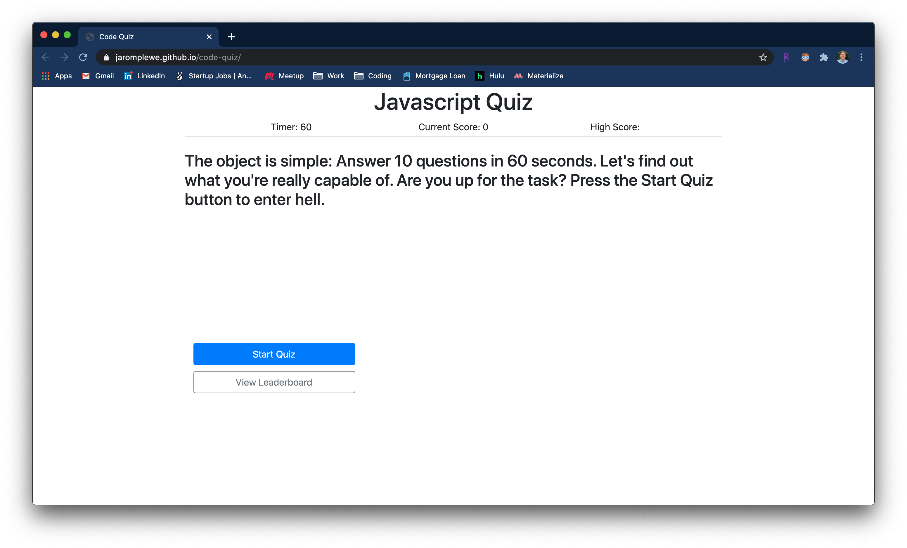
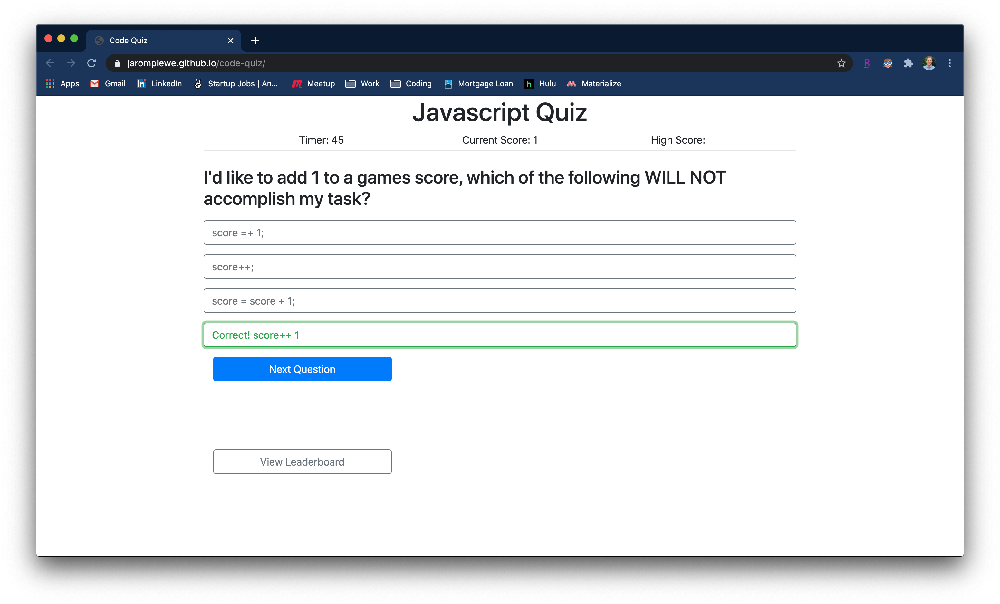
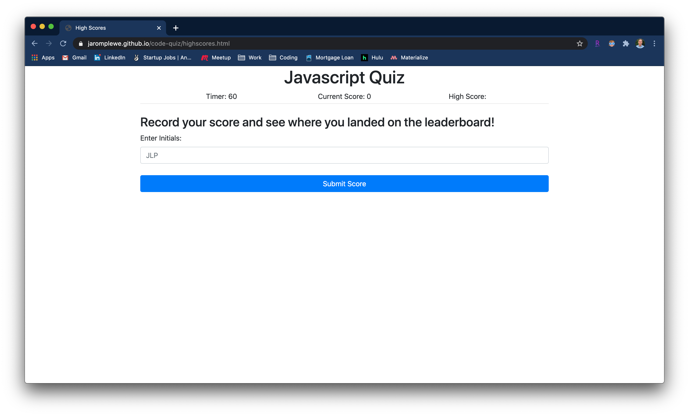
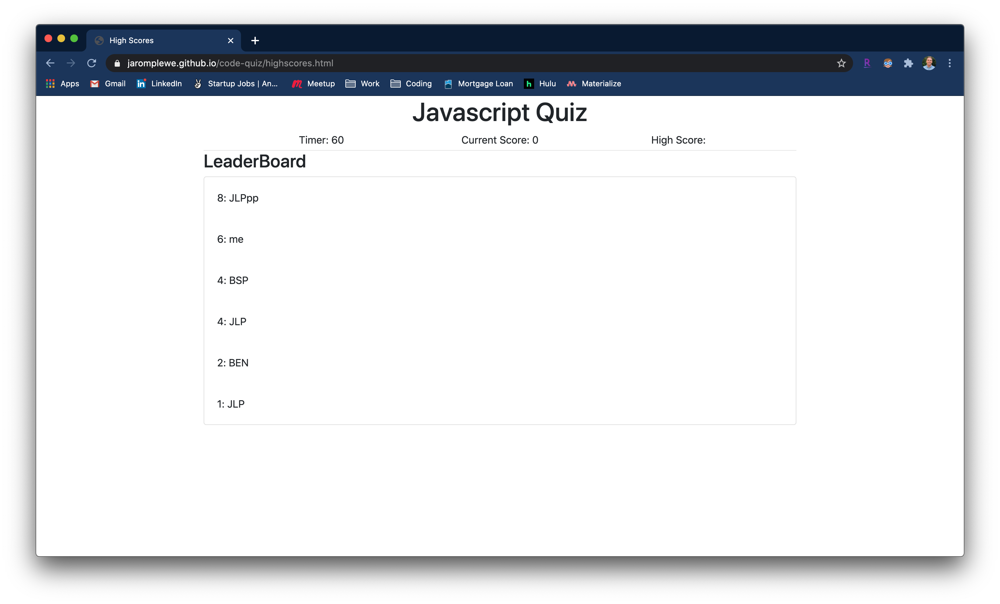

# Javascript Quiz

Practice your Javascript skills with this Javascript quiz!

* Vanilla Javascript
* LocalStorage
* Bootstrap CSS Framework

## How To Play

```
Press the "Start Quiz" button to begin answering quesitons. Once you start, the timer will begin counting down from 60 seconds. If the time runs out before you answer all 10 questions, the game will be over.

Enter your initials and submit your score to be entered onto the leaderboard.
```

## Screenshots

Start Screen


Questions:
* Correct answers display green
* Incorrect answers display red


Submit Screen:
* Enter your initials and find out where you lined up on the leaderboard!


Leaderboard:
